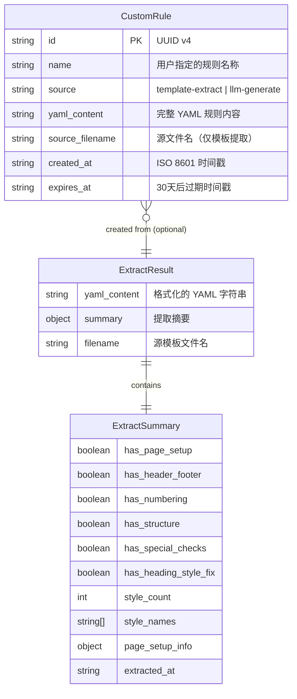

# Data Model: 模板提取与规则管理

**Feature**: 003-template-extraction  
**Date**: 2026-03-10

## 实体总览



## 实体详情

### 1. CustomRule（自定义规则）

**存储位置**: 浏览器 localStorage  
**存储键名**: `docx-fix:custom-rules`  
**生命周期**: 创建后 30 天过期自动清理

| 字段 | 类型 | 必填 | 说明 |
|------|------|------|------|
| `id` | `string` | ✅ | UUID v4，创建时自动生成 |
| `name` | `string` | ✅ | 用户指定的规则名称，支持重命名 |
| `source` | `"template-extract" \| "llm-generate"` | ✅ | 规则来源 |
| `yaml_content` | `string` | ✅ | 完整的 YAML 规则文本 |
| `source_filename` | `string \| undefined` | ❌ | 仅模板提取时记录源 `.docx` 文件名 |
| `created_at` | `string` | ✅ | ISO 8601 格式创建时间 |
| `expires_at` | `string` | ✅ | ISO 8601 格式过期时间（created_at + 30天） |

**验证规则**:

- `name`: 非空，长度 1-100 字符
- `yaml_content`: 非空，MUST 是合法的 YAML 字符串
- `source`: MUST 是枚举值之一
- `expires_at`: MUST 大于 `created_at`
- `id`: MUST 在 localStorage 的规则列表中唯一

**状态转换**: 无显式状态机。规则只有"存在"和"过期删除"两个隐式状态，通过 `expires_at` 时间判断。

### 2. ExtractResult（提取结果）

**存储位置**: 仅存在于内存中（API 响应 → 前端状态），不持久化  
**生命周期**: 请求 → 响应 → 前端展示 → 用户决定是否保存为 CustomRule

| 字段 | 类型 | 说明 |
|------|------|------|
| `yaml_content` | `string` | 后端返回的格式化 YAML 字符串 |
| `summary` | `ExtractSummary` | 提取摘要对象 |
| `filename` | `string` | 源模板文件名 |

### 3. ExtractSummary（提取摘要）

**嵌套于** ExtractResult

| 字段 | 类型 | 说明 |
|------|------|------|
| `has_page_setup` | `boolean` | 是否检测到页面设置 |
| `has_header_footer` | `boolean` | 是否检测到页眉页脚 |
| `has_numbering` | `boolean` | 是否检测到编号定义 |
| `has_structure` | `boolean` | 是否检测到文档结构 |
| `has_special_checks` | `boolean` | 是否检测到特殊检查规则 |
| `has_heading_style_fix` | `boolean` | 是否检测到标题样式修复规则 |
| `style_count` | `number` | 检测到的样式数量 |
| `style_names` | `string[]` | 检测到的样式名称列表 |
| `page_setup_info` | `{ paper_size: string, width_cm: number, height_cm: number } \| null` | 页面设置摘要 |
| `extracted_at` | `string` | 提取时间（ISO 8601） |

## 实体关系

```
ExtractResult ──(用户点击"保存规则")──▶ CustomRule
     │
     │ 1:1 包含
     ▼
ExtractSummary

CustomRule[] ──(JSON 序列化)──▶ localStorage["docx-fix:custom-rules"]

CustomRule ──(选用为检查规则)──▶ POST /api/check { custom_rules_yaml: yaml_content }
```

## localStorage 序列化格式

```json
[
  {
    "id": "550e8400-e29b-41d4-a716-446655440000",
    "name": "哈工大中期报告格式",
    "source": "template-extract",
    "yaml_content": "meta:\n  name: 哈工大中期报告格式\n  ...",
    "source_filename": "中期报告模板.docx",
    "created_at": "2026-03-10T11:00:00.000Z",
    "expires_at": "2026-04-09T11:00:00.000Z"
  },
  {
    "id": "6ba7b810-9dad-11d1-80b4-00c04fd430c8",
    "name": "自定义论文格式",
    "source": "llm-generate",
    "yaml_content": "meta:\n  name: 自定义论文格式\n  ...",
    "created_at": "2026-03-08T09:30:00.000Z",
    "expires_at": "2026-04-07T09:30:00.000Z"
  }
]
```

## 后端 Schema 映射（已实现）

| 前端类型 | 后端 Pydantic Schema | 文件位置 |
|----------|---------------------|----------|
| `ExtractResult` | `ExtractRulesResponse` | `backend/api/schemas.py` |
| `ExtractSummary` | `ExtractRulesSummary` | `backend/api/schemas.py` |
| `page_setup_info` | `ExtractRulesPageSetup` | `backend/api/schemas.py` |
| `CustomRule` | N/A（纯前端实体） | `frontend/src/types/index.ts` |
