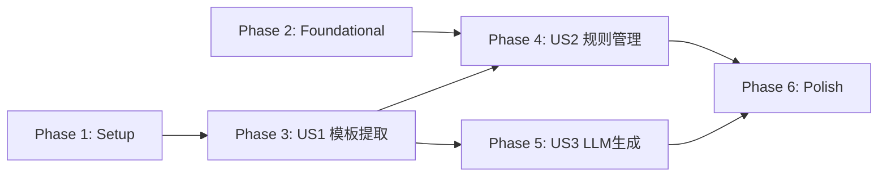

# Tasks: 模板提取与规则管理

**Input**: Design documents from `/specs/003-template-extraction/`
**Prerequisites**: plan.md ✅, spec.md ✅, research.md ✅, data-model.md ✅, contracts/ ✅, quickstart.md ✅

**Tests**: spec.md Testing Strategy 中明确列出了测试文件，包含测试任务。

**Organization**: Tasks 按 User Story 分组，每个 Story 可独立实现和测试。

## Format: `[ID] [P?] [Story] Description`

- **[P]**: Can run in parallel (different files, no dependencies)
- **[Story]**: Which user story this task belongs to (e.g., US1, US2, US3)
- Include exact file paths in descriptions

## Path Conventions

- **Backend**: `backend/` (Python / FastAPI)
- **Frontend**: `frontend/src/` (React + TypeScript)
- **Core Engine**: 根目录（不修改）

---

## Phase 1: Setup (Shared Infrastructure)

**Purpose**: 前端类型定义和基础服务模块，为所有 User Story 提供公共基础

- [x] T001 新增 CustomRule、ExtractResult、ExtractSummary 等前端类型定义到 `frontend/src/types/index.ts`
- [x] T002 [P] 新增 `extractRules()` API 调用函数到 `frontend/src/services/api.ts`
- [x] T003 [P] 创建 localStorage 规则管理服务 `frontend/src/services/ruleStorage.ts`（init/getAll/getById/save/rename/remove/getStorageSize/isAvailable）

---

## Phase 2: Foundational (Blocking Prerequisites)

**Purpose**: 扩展后端 check/fix API 支持 custom_rules_yaml 参数，是 US2 规则选用流程的前提

**⚠️ CRITICAL**: US2 的"在检查流程中选用自定义规则"功能依赖此阶段完成

- [x] T004 扩展 `POST /api/check` 端点，新增 `custom_rules_yaml` 可选 Form 字段，收到时写入临时 YAML 文件并传给 checker_service，完成后清理 — `backend/api/routes.py`
- [x] T005 [P] 扩展 `POST /api/fix` 端点，新增 `custom_rules_yaml` 可选 Form 字段，逻辑同 check — `backend/api/routes.py`
- [x] T006 [P] 扩展前端 `checkFile()` 和 `fixFile()` 函数，新增可选 `customRulesYaml` 参数 — `frontend/src/services/api.ts`

**Checkpoint**: 后端 check/fix 支持自定义规则 YAML，基础服务就绪

---

## Phase 3: User Story 1 — 上传模板文档提取规则 (Priority: P1) 🎯 MVP

**Goal**: 用户在 Web 主页点击"提取模板"Tab，上传 `.docx` 模板文件，后端提取格式规则返回 YAML 预览

**Independent Test**: 上传已知模板 `.docx` 文件，确认页面正确展示提取摘要和 YAML 预览，YAML 内容与 CLI 输出一致

### Tests for User Story 1 ⚠️

- [ ] T007 [P] [US1] 后端提取服务单元测试 — `backend/tests/test_extractor_service.py`（正常提取、YAML 生成、摘要构建）
- [ ] T008 [P] [US1] 后端提取 API 集成测试 — `backend/tests/test_api_extract.py`（正常提取、文件类型校验、损坏文件处理）

### Implementation for User Story 1

- [x] T009 [US1] 创建 YAML 语法高亮工具函数（手动正则方案） — `frontend/src/utils/yamlHighlight.ts`
- [x] T010 [US1] 创建 ExtractPanel 模板提取面板组件（上传区域 + 加载状态 + 提取摘要卡片 + YAML 预览 + 规则名称编辑 + 保存按钮） — `frontend/src/components/ExtractPanel.tsx`
- [x] T011 [US1] 修改 App.tsx，新增顶部 Tab 导航（"上传检查" / "提取模板"），根据当前 Tab 切换展示 UploadPanel 或 ExtractPanel — `frontend/src/App.tsx`
- [ ] T012 [US1] ExtractPanel 组件测试 — `frontend/src/__tests__/components/ExtractPanel.test.tsx`

**Checkpoint**: 模板提取核心流程完整可用 — 上传 → 提取 → 预览 → 保存到本地

---

## Phase 4: User Story 2 — 保存和管理自定义规则 (Priority: P2)

**Goal**: 用户可保存提取结果为自定义规则（localStorage, 30天过期），查看/重命名/删除/下载规则，在检查流程中选用自定义规则

**Independent Test**: 提取规则后保存，关闭浏览器重新打开确认规则仍在；超过30天后刷新确认规则已清理

### Tests for User Story 2 ⚠️

- [ ] T013 [P] [US2] localStorage 规则存储服务测试 — `frontend/src/__tests__/services/ruleStorage.test.ts`（保存/读取/删除/过期清理/容量监控/隐私模式降级）
- [ ] T014 [P] [US2] RuleManager 组件测试 — `frontend/src/__tests__/components/RuleManager.test.tsx`

### Implementation for User Story 2

- [x] T015 [US2] 创建 RuleManager 规则管理面板组件（规则列表 + YAML 详情预览 + 重命名 + 删除确认 + 下载 YAML 文件） — `frontend/src/components/RuleManager.tsx`
- [x] T016 [US2] 在 ExtractPanel 中集成 RuleManager，提取页面下方显示"我的规则"区域 — `frontend/src/components/ExtractPanel.tsx`
- [x] T017 [US2] 修改 UploadPanel 规则选择器，合并展示服务端预置规则和 localStorage 自定义规则（分组显示，来源标签区分） — `frontend/src/components/UploadPanel.tsx`
- [x] T018 [US2] 修改 UploadPanel 和 App.tsx 检查/修复流程，选择自定义规则时通过 `custom_rules_yaml` 参数传递 YAML 内容 — `frontend/src/components/UploadPanel.tsx` + `frontend/src/App.tsx`

**Checkpoint**: 规则管理闭环完成 — 保存/查看/编辑/删除/选用自定义规则均可用

---

## Phase 5: User Story 3 — 自然语言格式要求生成 YAML 规则 (Priority: P3)

**Goal**: 用户在"提取模板"页面切换到"文字描述"模式，输入自然语言格式要求，由 LLM 生成 YAML 规则并预览/保存

**Independent Test**: 输入格式要求文本，确认生成的 YAML 可被 checker.py 正常加载

### Implementation for User Story 3

- [x] T019 [US3] 新增前端 `generateRules()` API 调用函数（调用 `POST /api/ai/generate-rules`） — `frontend/src/services/api.ts`
- [x] T020 [US3] 在 ExtractPanel 顶部新增模式切换 Tabs（"上传模板" / "文字描述"），"文字描述"模式下展示 textarea + "生成规则"按钮，调用 LLM 端点 — `frontend/src/components/ExtractPanel.tsx`
- [x] T021 [US3] 处理 LLM 不可用降级：显示"AI 服务暂不可用"提示，不影响"上传模板"模式 — `frontend/src/components/ExtractPanel.tsx`

**Checkpoint**: LLM 规则生成流程完整 — 输入文本 → 调用 AI → 预览 YAML → 保存

---

## Phase 6: Polish & Cross-Cutting Concerns

**Purpose**: 边界情况处理、性能优化、回归测试

- [x] T022 [P] 处理 localStorage 边界情况：存储空间不足提示、隐私模式降级提示、YAML 过大提示（> 4MB） — `frontend/src/services/ruleStorage.ts`
- [x] T023 [P] 多 Tab 数据一致性：监听 `window storage` 事件同步 ruleStorage 状态 — `frontend/src/services/ruleStorage.ts`
- [x] T024 [P] 空白模板处理：后端在提取结果为空时返回友好提示"未检测到有效格式规则" — `backend/api/routes.py`
- [x] T025 运行 quickstart.md 中的完整验证流程，确认所有功能路径正常
- [x] T026 [P] 代码清理与注释补充，确保所有新文件符合项目编码规范

---

## Dependencies & Execution Order

### Phase Dependencies

- **Setup (Phase 1)**: No dependencies — can start immediately
- **Foundational (Phase 2)**: Can start in parallel with Phase 1 (different file groups)
- **US1 (Phase 3)**: Depends on Phase 1 (T001, T002, T003) completion
- **US2 (Phase 4)**: Depends on Phase 2 (T004-T006) + Phase 3 (T010, T011) completion
- **US3 (Phase 5)**: Depends on Phase 3 (T010, T011) completion; can parallelize with Phase 4
- **Polish (Phase 6)**: Depends on all desired user stories being complete

### User Story Dependencies



- **US1 (P1)**: 依赖 Setup → 可独立实现和测试
- **US2 (P2)**: 依赖 Foundational + US1（ExtractPanel + App Tab 已创建）→ 独立可测
- **US3 (P3)**: 依赖 US1（ExtractPanel 已创建）→ 独立可测，可与 US2 并行

### Within Each User Story

- Tests MUST be written and FAIL before implementation
- 工具函数/服务 → 组件 → 集成 → 测试验证
- Story complete before moving to next priority

### Parallel Opportunities

**Phase 1 内部并行**:
- T002 和 T003 互不依赖，可并行（不同文件）

**Phase 2 内部并行**:
- T004 和 T005 修改同一文件但不同端点，T006 在前端 → T004+T005 可并行，T006 与之并行

**Phase 3 内部并行**:
- T007 和 T008 是独立测试文件，可并行

**Phase 4 内部并行**:
- T013 和 T014 是独立测试文件，可并行

**US2 与 US3 可并行**:
- US3 (T019-T021) 仅依赖 US1 的 ExtractPanel，不依赖 US2 的 RuleManager

---

## Parallel Example: User Story 1

```bash
# 先并行运行测试（确认 FAIL）:
Task T007: "后端提取服务单元测试 — backend/tests/test_extractor_service.py"
Task T008: "后端提取 API 集成测试 — backend/tests/test_api_extract.py"

# 然后串行实现:
Task T009: "YAML 语法高亮工具函数 — frontend/src/utils/yamlHighlight.ts"
Task T010: "ExtractPanel 模板提取面板 — frontend/src/components/ExtractPanel.tsx"
Task T011: "App.tsx 新增 Tab 导航"
Task T012: "ExtractPanel 组件测试"
```

---

## Implementation Strategy

### MVP First (User Story 1 Only)

1. Complete Phase 1: Setup（类型 + API + ruleStorage）
2. Complete Phase 2: Foundational（check/fix API 扩展）
3. Complete Phase 3: User Story 1（模板提取核心流程）
4. **STOP and VALIDATE**: 上传模板 → 提取 → 预览 → 保存，全链路验证
5. Deploy/demo if ready

### Incremental Delivery

1. Setup + Foundational → 基础就绪
2. Add US1（模板提取）→ 独立测试 → Deploy（**MVP!**）
3. Add US2（规则管理）→ 独立测试 → Deploy
4. Add US3（LLM 生成）→ 独立测试 → Deploy
5. Polish → 边界处理 + 回归测试

### Parallel Team Strategy

With 2 developers:

1. Team completes Setup + Foundational together
2. Once Foundational is done:
   - Developer A: US1 → US2
   - Developer B: US1 tests → US3（US1 核心组件就绪后）
3. Stories integrate independently

---

## Notes

- [P] tasks = different files, no dependencies
- [Story] label maps task to specific user story for traceability
- 后端 `extractor_service.py`、`routes.py` extract-rules 端点、`schemas.py` 提取类型 — **已在 plan 阶段完成**，不重复列为 task
- `rule_extractor.py`（根目录核心引擎）— **不修改**
- Commit after each task or logical group
- Stop at any checkpoint to validate story independently
