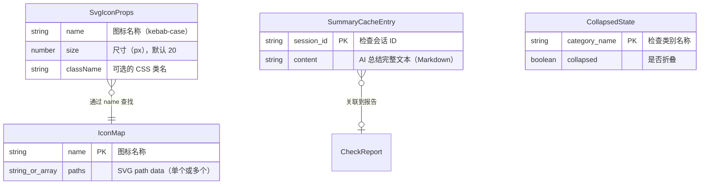

# Data Model: UI 样式美化与体验优化

**Feature**: 004-ui-polish
**Date**: 2026-03-10

## 实体总览

本 spec 为纯前端 UI 优化，不引入持久化实体。所有数据结构均为运行时内存状态。



## 实体详情

### 1. IconMap（图标映射表）

**存储位置**: `SvgIcon.tsx` 内部常量
**生命周期**: 编译时确定，运行时只读

| 字段 | 类型 | 说明 |
|------|------|------|
| `[name]` | `string` | 图标名称，kebab-case（如 `chart-bar`、`alert-triangle`） |
| `paths` | `string \| string[]` | SVG path data。单 path 为 string，多 path 为 string[] |

**验证规则**:
- `name` MUST 是 kebab-case 格式
- `paths` MUST 是合法的 SVG path `d` 属性值
- 所有图标 MUST 基于 24x24 viewBox 设计

**总量约束**: 约 25 个图标，总 path data 大小 < 10KB

### 2. SvgIconProps（组件属性接口）

**存储位置**: TypeScript 接口定义
**生命周期**: 编译时类型检查

| 字段 | 类型 | 必填 | 默认值 | 说明 |
|------|------|------|--------|------|
| `name` | `string` | ✅ | — | 图标名，对应 IconMap 的 key |
| `size` | `number` | ❌ | `20` | 图标宽高（px） |
| `className` | `string` | ❌ | `undefined` | 额外的 CSS 类名 |

**验证规则**:
- `name` 不存在于 iconMap 时，组件返回 `null`（静默降级）
- `size` MUST > 0

### 3. SummaryCacheEntry（AI 总结缓存条目）

**存储位置**: `services/aiCache.ts` 模块级 `Map<string, string>`
**生命周期**: SPA 运行期间（页面刷新后清空）

| 字段 | 类型 | 说明 |
|------|------|------|
| `session_id` (key) | `string` | 检查会话 ID，由后端生成 |
| `content` (value) | `string` | AI 总结的完整 Markdown 文本 |

**验证规则**:
- 只有 SSE 请求 `state === "done"` 时才写入缓存
- 流式中断的不完整内容 MUST NOT 写入缓存
- 缓存上限 50 条，超出时 FIFO 淘汰最早条目

**状态转换**:

```
[不存在] ──(SSE done)──▶ [已缓存]
[已缓存] ──(用户点击"重新分析")──▶ [不存在]
[已缓存] ──(页面刷新)──▶ [不存在]
[已缓存] ──(FIFO 淘汰)──▶ [不存在]
```

### 4. CollapsedState（类别折叠状态）

**存储位置**: `CheckReport.tsx` 组件内部 `useState`
**生命周期**: 组件挂载期间

| 字段 | 类型 | 说明 |
|------|------|------|
| `[category]` (key) | `string` | 检查类别名称 |
| `collapsed` (value) | `boolean` | `true` = 折叠，`false` = 展开 |

**初始化规则**:
- 类别中所有检查项均为 PASS → 初始值 `true`（折叠）
- 类别中存在 FAIL 或 WARN → 初始值 `false`（展开）

**操作**:
- 点击类别头部 → 切换该类别的 `collapsed` 值
- "展开全部" → 所有 key 设为 `false`
- "收起全部" → 所有 key 设为 `true`

## 实体关系

```
IconMap (静态常量)
  │
  │ SvgIcon 通过 name 查找 path
  ▼
SvgIconProps ──(渲染)──▶ <svg> DOM 元素

SummaryCacheEntry (模块级 Map)
  │
  │ AiSummary 组件挂载时检查
  ▼
AiSummary.tsx ──(命中)──▶ 直接渲染缓存内容
              ──(未命中)──▶ 发起 SSE 请求 ──(done)──▶ 写入缓存

CollapsedState (组件 useState)
  │
  │ CheckReport 渲染时使用
  ▼
类别区块 ──(collapsed=true)──▶ 折叠为一行摘要
         ──(collapsed=false)──▶ 展开显示所有检查项
```

## 无后端实体变更

本 spec 为纯前端优化，不涉及：
- 后端 Pydantic schema 变更
- 数据库/文件系统持久化
- API 接口增减
- localStorage 数据结构变更
