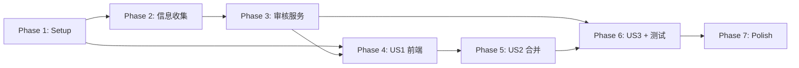

# Tasks: 模板提取 LLM 智能审核

**Input**: Design documents from `/specs/009-extract-review/`
**Prerequisites**: plan.md ✅, spec.md ✅

**Tests**: spec.md Testing Strategy 中明确列出了测试文件，包含测试任务。

**Organization**: Tasks 按 Phase/User Story 分组，每个 Story 可独立实现和测试。

## Format: `[ID] [P?] [Story] Description`

- **[P]**: Can run in parallel (different files, no dependencies)
- **[Story]**: Which user story this task belongs to (e.g., US1, US2, US3)
- Include exact file paths in descriptions

## Path Conventions

- **Backend**: `backend/` (Python / FastAPI)
- **Frontend**: `frontend/src/` (React + TypeScript)
- **Core Engine**: `backend/scripts/rule_extractor/`

---

## Phase 1: Setup — Schema + Config + Prompt 基础

**Purpose**: 新增数据模型、配置项和 prompt 模板，为后续所有 Phase 提供公共基础

- [ ] T001 [P] 新增审核相关 Schema 到 `backend/api/schemas.py`（`ColoredTextParagraph`、`HeadingStructureItem`、`ExtractReviewItem`、`ExtractReviewRequest`、`ExtractReviewResponse`、`ExtractReviewContext`），同时修改 `ExtractRulesResponse` 新增可选字段 `review_context: Optional[ExtractReviewContext]`
- [ ] T002 [P] 新增配置项 `LLM_REVIEW_MAX_TOKENS = 4096` 到 `backend/config.py`
- [ ] T003 [P] 新增审核专用 prompt 模板 `REVIEW_EXTRACT_SYSTEM_PROMPT` 到 `backend/services/ai_prompts.py`，覆盖四个审核维度（标题级别异常、特殊颜色字体隐含规则、规则内部矛盾、综合质量评估），严格要求 JSON 数组输出格式，不含 ID 字段
- [ ] T004 [P] 新增前端审核相关类型到 `frontend/src/types/index.ts`（`ExtractReviewItem`、`ColoredTextParagraph`、`HeadingStructureItem`、`ExtractReviewContext`），扩展 `ExtractRulesResponse` 新增 `review_context?`

---

## Phase 2: 后端 — 信息收集增强 (FR-001 ~ FR-003)

**Purpose**: 在 RuleExtractor 提取过程中收集审核所需的上下文信息

**⚠️ CRITICAL**: Phase 3 的审核服务依赖此阶段产出的 `review_context` 数据

- [ ] T005 新增特殊颜色字体段落收集方法到 `backend/scripts/rule_extractor/style_extractor.py` — 遍历每个段落的 runs，检测 run 级 (`run.font.color.rgb`) 和样式级颜色，收集非黑色(`000000`)/非 auto 的段落信息（索引、文本、颜色值、前后段落文本），返回 `list[dict]`
- [ ] T006 [P] 新增标题结构摘要收集方法到 `backend/scripts/rule_extractor/structure_extractor.py` — 遍历文档段落，对带有 Heading 样式或 outline_level 的段落，收集索引、标题文字、样式名、大纲级别，返回 `list[dict]`
- [ ] T007 修改 `backend/scripts/rule_extractor/base.py` 的 `extract_all()` 方法 — 在提取流程中调用 T005/T006 新增的收集方法，将结果保存为实例属性 `self._colored_text_paragraphs` 和 `self._heading_structure`
- [ ] T008 修改 `backend/services/extractor_service.py` 的 `run_extract()` 方法 — 在提取完成后从 `extractor` 实例读取 `_colored_text_paragraphs` 和 `_heading_structure`，组装 `review_context` 并添加到响应中
- [ ] T009 修改 `backend/api/extract_routes.py` 的 `POST /api/extract-rules` 端点 — 将 `review_context` 字段包含在响应中返回给前端

**Checkpoint**: `POST /api/extract-rules` 响应新增 `review_context` 字段，包含特殊颜色字体段落和标题结构摘要

---

## Phase 3: 后端 — LLM 审核服务 (FR-004 ~ FR-013)

**Purpose**: 实现 LLM 审核核心逻辑：调用 LLM → 解析 JSON → 生成 ID → 二次校验

- [ ] T010 创建 `backend/services/extract_review_service.py` — 实现审核服务核心逻辑：
  - `review_extract_rules(yaml_content, colored_text_paragraphs, heading_structure)` 主方法
  - 组装 LLM 输入（YAML + 颜色文字列表 + 标题结构摘要，标题 outline_level 做 +1 转换附 Heading N 说明）
  - 调用 `llm_service.chat_completion()`（使用 `REVIEW_EXTRACT_SYSTEM_PROMPT`，max_tokens 使用 `LLM_REVIEW_MAX_TOKENS`）
  - 解析 LLM 输出 JSON（复用 markdown 代码块提取策略去除 ` ```json ``` ` 包裹）
  - 遍历结果数组，为每条建议生成 ID（`f"rev-{i+1:03d}"`）
  - 二次校验每条建议：category 值域、severity 值域、section_path 非空且格式合法、yaml_snippet 通过 `yaml.safe_load()` 校验
  - 不合法条目静默丢弃并 `logging.warning()`
  - LLM 调用失败/超时（30秒）时返回空列表
  - LLM 不可用时（API Key 未配置等）直接返回空列表
- [ ] T011 修改 `backend/api/extract_routes.py` — 在 `extract_router` 下新增 `POST /extract-rules/review` 端点：
  - 接受 `ExtractReviewRequest` JSON body
  - 校验 `yaml_content` 非空（否则 400）
  - 调用 `extract_review_service.review_extract_rules()`
  - 返回 `ExtractReviewResponse`

**Checkpoint**: `POST /api/extract-rules/review` 可正确调用 LLM、解析输出、返回带 ID 的审核建议列表；LLM 不可用时返回空列表

---

## Phase 4: User Story 1 — 自动审核 + 建议展示 (Priority: P1) 🎯 MVP

**Goal**: 提取完成后自动发起审核请求，在提取预览下方展示审核建议卡片列表

**Independent Test**: 上传包含标题级别错误和特殊颜色字体说明的模板，确认审核建议正确识别并展示

### Implementation for User Story 1

- [ ] T012 [P] [US1] 新增 `reviewExtractRules()` API 调用函数到 `frontend/src/services/api.ts` — 接受 `yaml_content`、`colored_text_paragraphs`、`heading_structure`，POST 到 `/api/extract-rules/review`，返回 `ExtractReviewResponse`
- [ ] T013 [P] [US1] 创建 YAML deep merge 工具函数 `frontend/src/utils/yamlMerge.ts` — 实现 `mergeYamlPatch(originalYaml: string, sectionPath: string, yamlSnippet: string): string` 函数：使用 js-yaml 解析原始 YAML 和 snippet，按 section_path 做 deep merge，合并后重新序列化。路径不存在则创建，类型冲突时抛出错误
- [ ] T014 [US1] 创建审核建议面板组件 `frontend/src/components/ExtractReviewPanel.tsx` — 独立组件，Props 包含：`reviewItems`（建议列表）、`loading`（加载状态）、`error`（错误信息）、`onAccept(id)`、`onIgnore(id)`、`acceptedIds`（已接受 ID 集合）。每张卡片渲染：严重程度图标（🔴/🟡/🔵）、类别标签、问题描述、影响路径（`section_path`）、源文本（仅 hidden_rule）、"接受修改"/"忽略"切换按钮。底部"全部忽略"按钮。加载中展示"🤖 AI 正在审核提取结果..."。空结果展示"审核通过，未发现问题"
- [ ] T015 [US1] 修改 `frontend/src/components/ExtractResult.tsx` — 集成 ExtractReviewPanel：
  - 提取完成后自动发起审核请求（使用 `review_context` 中的数据）
  - 管理审核状态（loading / items / error / acceptedIds）
  - 将 ExtractReviewPanel 渲染在 YAML 预览区域下方
  - 审核超时（30秒）时展示"审核超时"提示
  - 审核失败时静默降级（不展示面板）

**Checkpoint**: 模板提取后自动出现审核建议，用户可查看每条建议的详情

---

## Phase 5: User Story 2 — 接受/忽略建议 + YAML 合并 (Priority: P2)

**Goal**: 用户可逐条接受/忽略建议，接受后 YAML 预览实时更新

**Independent Test**: 接受一条建议后 YAML 预览更新；撤销后恢复；保存时只含已接受的修改

### Implementation for User Story 2

- [ ] T016 [US2] 在 `ExtractResult.tsx` 中实现 YAML 合并逻辑 — 接受建议时调用 `mergeYamlPatch()` 合并到原始 YAML，更新 YAML 预览 state；撤销接受时从原始 YAML 重新合并所有仍被接受的建议。合并失败的建议标记为"无法应用"（UI 上禁用接受按钮并展示提示）
- [ ] T017 [US2] 修改 `ExtractResult.tsx` 的保存规则逻辑 — 保存时使用合并后的 YAML（仅含已接受建议的修改），而非原始 YAML

**Checkpoint**: 接受/撤销建议后 YAML 实时更新，保存的规则包含已接受的修改

---

## Phase 6: User Story 3 — 降级体验 (Priority: P3) + 测试

**Goal**: LLM 不可用时完全降级，编写测试覆盖核心逻辑

**Independent Test**: 配置错误的 API Key 后上传模板，确认提取正常、审核不显示

### Tests ⚠️

- [ ] T018 [P] [US3] 后端审核服务单元测试 — `backend/tests/test_extract_review_service.py`（mock LLM 调用，验证：正常 JSON 解析 + ID 生成、非法条目过滤、LLM 不可用返回空列表、LLM 输出格式错误降级、超时处理）
- [ ] T019 [P] [US3] 后端特殊颜色字体收集测试 — `backend/tests/test_extractor_colored_text.py`（测试 run 级颜色检测、样式级颜色检测、多种颜色、黑色/auto 排除、前后段落上下文）
- [ ] T020 [P] [US3] 后端标题结构摘要测试 — `backend/tests/test_extractor_heading_structure.py`（测试多级标题收集、outline_level 正确性、非标题段落排除）
- [ ] T021 [P] [US3] 后端审核 API 集成测试 — `backend/tests/test_api_extract_review.py`（测试正常审核返回、yaml_content 为空返回 400、LLM 不可用返回空列表）
- [ ] T022 [P] [US3] 前端 YAML merge 工具测试 — `frontend/src/__tests__/utils/yamlMerge.test.ts`（测试路径创建、覆盖、深层合并、类型冲突错误、无效 YAML 处理）
- [ ] T023 [P] [US3] 前端审核面板组件测试 — `frontend/src/__tests__/components/ExtractReviewPanel.test.tsx`（测试渲染、加载状态、空结果、接受/忽略交互、全部忽略按钮）

### Implementation for User Story 3

- [ ] T024 [US3] 验证降级体验 — 确认以下场景：①API Key 未配置时审核返回空列表；②网络错误时前端不展示审核面板；③审核超时时展示友好提示；④所有降级场景下提取流程不受影响

**Checkpoint**: 所有测试通过，降级体验验证完毕

---

## Phase 7: Polish & Cross-Cutting Concerns

**Purpose**: 边界情况处理、代码清理

- [ ] T025 [P] 审核输入截断控制 — 在 `extract_review_service.py` 中对输入做长度检查：YAML 内容截断至合理长度、颜色文字段落截断至 top-N 条、标题结构截断至 top-N 条，确保不超过 LLM 上下文窗口
- [ ] T026 [P] 前端安装 `js-yaml` 依赖 — `npm install js-yaml @types/js-yaml`（如未安装），确保 yamlMerge.ts 可正常使用
- [ ] T027 代码清理与注释补充，确保所有新文件符合项目编码规范

---

## Dependencies & Execution Order

### Phase Dependencies

- **Phase 1 (Setup)**: No dependencies — can start immediately
- **Phase 2 (信息收集)**: Depends on Phase 1 (T001 Schema 定义)
- **Phase 3 (审核服务)**: Depends on Phase 1 (T001-T003) + Phase 2 (T005-T009)
- **Phase 4 (US1 前端)**: Depends on Phase 1 (T004) + Phase 3 (T010-T011)
- **Phase 5 (US2 合并)**: Depends on Phase 4 (T014-T015)
- **Phase 6 (US3 + 测试)**: Depends on Phase 3-5 completion
- **Phase 7 (Polish)**: Depends on Phase 3-5 completion

### User Story Dependencies



- **Phase 1**: 可立即开始，T001-T004 全部可并行
- **Phase 2**: T005 和 T006 可并行（不同文件），T007 依赖 T005+T006，T008 依赖 T007，T009 依赖 T008
- **Phase 3**: T010 独立，T011 依赖 T010
- **Phase 4**: T012 和 T013 可并行，T014 依赖 T013，T015 依赖 T012+T014
- **Phase 5**: T016 依赖 T015，T017 依赖 T016
- **Phase 6**: T018-T023 全部可并行（不同测试文件），T024 依赖所有前置 Phase
- **Phase 7**: T025 和 T026 可并行

### Within Each Phase

- Schema / 类型定义先于业务逻辑
- 后端服务先于 API 端点
- 工具函数先于组件
- 组件创建先于集成
- 测试可在对应功能完成后并行编写

### Parallel Opportunities

**Phase 1 全部可并行**:
- T001（后端 Schema）、T002（配置）、T003（Prompt）、T004（前端类型）互不依赖

**Phase 2 内部**:
- T005 和 T006 可并行（不同 extractor 文件）

**Phase 4 内部**:
- T012 和 T013 可并行（不同文件）

**Phase 6 测试全部可并行**:
- T018-T023 均为独立测试文件

---

## Implementation Strategy

### MVP First (Phase 1-4)

1. Complete Phase 1: Setup（Schema + Config + Prompt + 类型）
2. Complete Phase 2: 信息收集增强
3. Complete Phase 3: LLM 审核服务
4. Complete Phase 4: US1 前端展示
5. **STOP and VALIDATE**: 上传模板 → 提取 → 审核建议自动展示，全链路验证

### Incremental Delivery

1. Phase 1-3 → 后端完整可用 → API 可手动测试
2. Phase 4 → US1 MVP → 审核建议可视化
3. Phase 5 → US2 → 接受/忽略交互 + YAML 合并
4. Phase 6 → US3 + 测试 → 降级体验 + 测试覆盖
5. Phase 7 → Polish → 收尾清理

---

## Notes

- [P] tasks = different files, no dependencies
- [Story] label maps task to specific user story for traceability
- 后端 `llm_service.py` **不修改**，复用现有 LLM 调用封装
- 核心引擎 `rule_extractor/` 中的修改仅新增信息收集方法，不改变原有提取逻辑
- LLM 审核的任何异常都不影响已有提取功能
- Commit after each task or logical group
- Stop at any checkpoint to validate independently

... EOF no more lines ...
